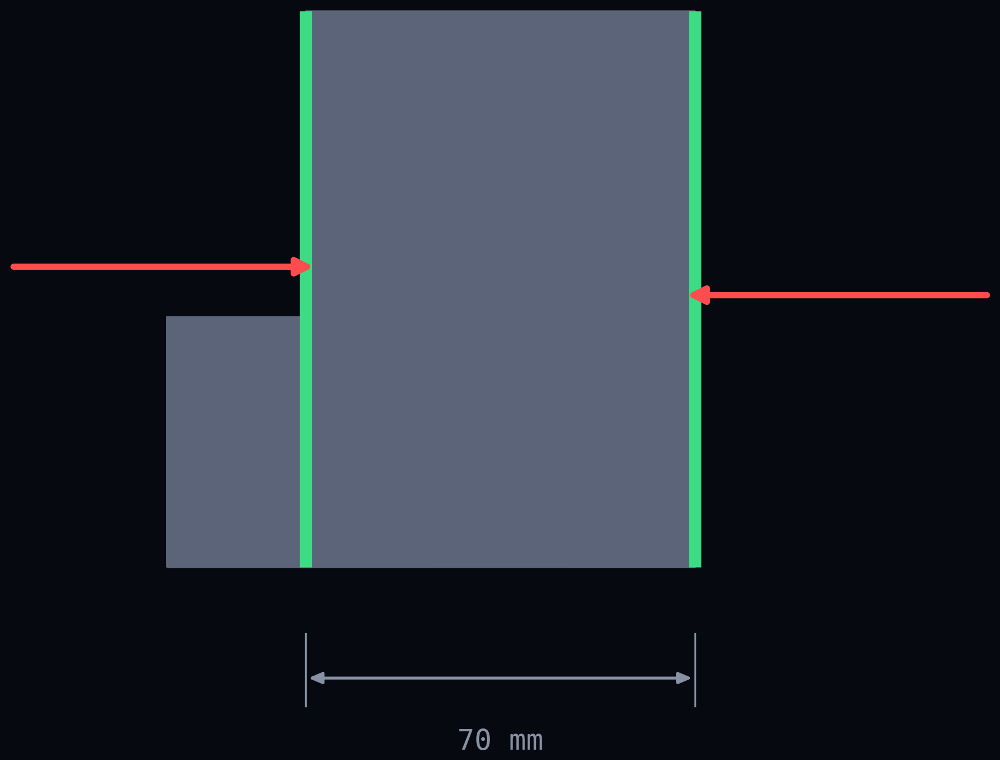
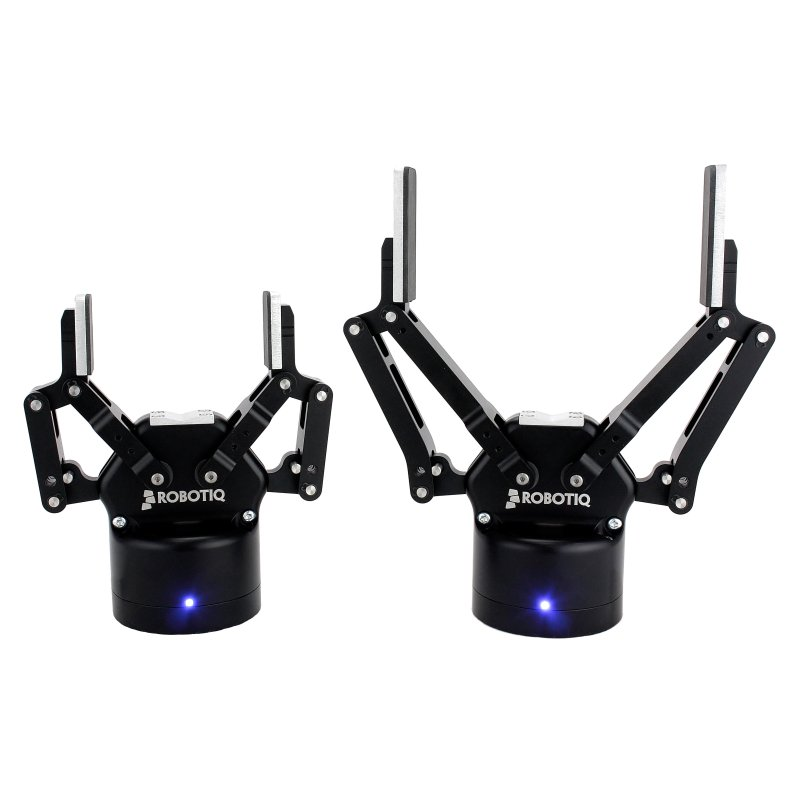
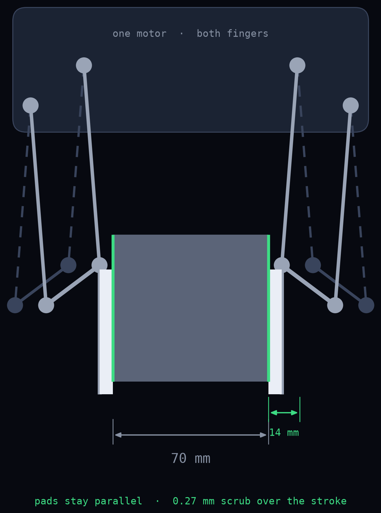

# Robot Gripper - Part B

A two-finger gripper for an automated production cell, designed as a semester
project for *Produktdesign und Produktentwicklung*, MRE WS 2026/27.

A robot picks a PA 6 part off a buffer belt at 1000 mm, carries it 1800 mm and
places it on a workpiece carrier at 1300 mm. Cycle time is 5 seconds per part.
The part is given; the gripper is not.

**Team:** Bitsch Elias · Ovdiienko Viktoriia - Group 10
**Plan:** [PLAN.md](PLAN.md) · **Status:** concept phase, design freeze 4 Oct 2026

---

## 🔩 The part

| | |
|---|---|
| Bounding box | 95 × 100 × 80 mm |
| Volume | 528.5 cm³ |
| Material | PA 6, ρ = 1140 kg/m³ |
| Mass | 0.602 kg |
| Surface | Ra 1.6 |

Two flat, parallel side faces 70 mm apart, 6200 mm² on the smaller side. The
assignment allows gripping **from the side only** - no undergripping on the
belt, which rules out both a vacuum cup and anything that reaches underneath.



---

## The concept

A **2-finger parallel gripper**, one **four-bar parallelogram per finger**,
driven by a single **servo motor** through a self-locking screw.

The design is **inspired by the Robotiq 2F-85**: electric, two fingers, one
four-bar per finger, pads that stay parallel. What we do not take over is its
underactuated adaptive wrap - in encompassing mode that is statically
indeterminate, and on two flat faces it buys nothing.



*Robotiq 2F-85 and 2F-140. Photo: Robotiq Inc., used as a design reference.*



*Our version: links 90 mm, swing +-4.46 degrees, 14 mm stroke per side.*

Why this and not a rack:

- **Pads stay parallel** through the four-bar, so the flat faces stay in full contact
- **The screw is self-locking** - the part holds on power failure, no brake needed
- The tip travels on an arc, but with 90 mm links and ±4.46° of swing that is
  **0.27 mm of scrub** over the full 14 mm stroke per side

The price, stated honestly: jaw force is **not constant** over the stroke. The
worst transmission angle has to be proven, not assumed.

**Required gripping force:** 14.3 N per jaw (µ = 0.5 NBR/PA 6, safety factor 2.0,
path acceleration 2.05 m/s² out of the cycle-time budget).

---

## 🤖 The cell

Robot is an **ABB IRB 1600-6/1.45**. The interesting finding from the placement
study: with the robot centred on the floor the sequence is **not executable** -
not because of reach, but because of axis 5 (±115°). With the arm extended high
and far the forearm points steeply up and the tool can no longer be brought
vertical. The fix is a **500 mm pedestal plus a 100 mm base offset** toward the
workpiece carrier. That goes into the report as a finding, not hidden.

---

## 🛠 Toolchain

| Tool | Used for |
|---|---|
| **Onshape** | parametric CAD and FEM on the same model |
| **LaTeX** | calculations and the written report |
| **MuJoCo** | motion sequence, collision check, contact forces |
| **build123d / gmsh / CalculiX** | scripted geometry and the independent FEM cross-check |
| **FDM printing** | a printed jaw, loaded and measured, as a third data point against the FEM |

---

## Repository layout

```
├─ Elias/            system & numerical proof
├─ Viktoriia/        design & analytical proof
├─ shared/
│  ├─ submission/    final structure per Fig. 2 - German names, prescribed
│  └─ references/
├─ videos/           plan pitch video (HyperFrames)
├─ cad/ fem/ sim/    preliminary script chain, kept as reference
└─ PLAN.md
```

Each of us commits only inside our own folder, so there are no merge conflicts.
Merging happens once, at the end, in `shared/submission/`.

The four folder names under `shared/submission/` stay German on purpose - the
assignment prescribes that structure verbatim.

---

## 📅 Dates

| | |
|---|---|
| Design freeze | 4 Oct 2026 |
| Interim report | **26 Nov 2026** |
| Final review | **15 Jan 2027** |

Both are BB-1 dates. We are in different course groups and run on the earlier
schedule deliberately - see open point 0 in the plan.

---

## Grading

100 points across nine packages. The 3D design carries 20 on its own, every
other package 10. The full breakdown, the milestone plan and the open questions
are in [PLAN.md](PLAN.md).
